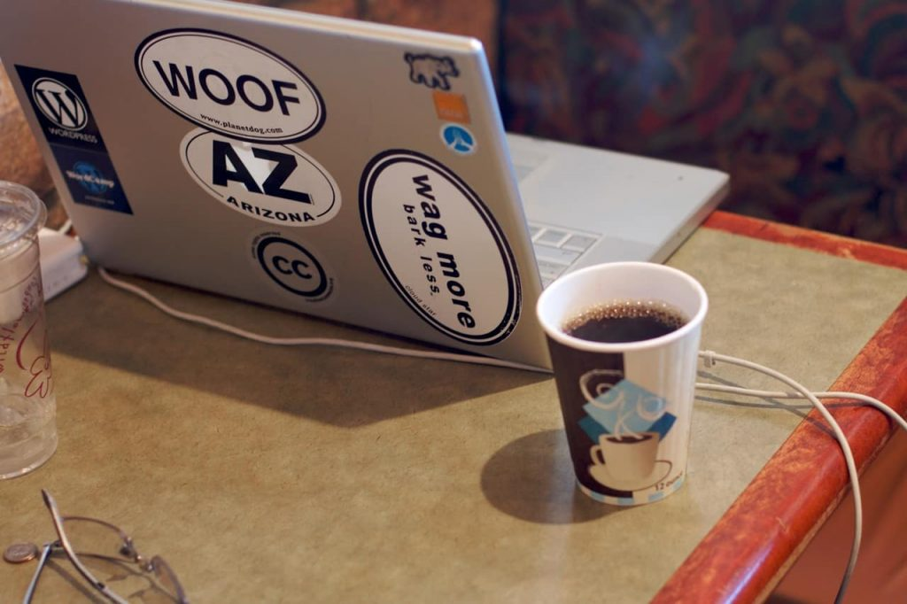

Что такое README?
По сути, README это просто текстовый файл (в формате .txt или .md), играющий роль быстрой справки по проекту или директории. Обычно это самая заметная часть документации и landing page для большинства проектов с открытым кодом. Даже само название файла пишется одними заглавными буквами, чтобы привлечь внимание читателя и побудить его прочесть это файл в первую очередь.

Доказано, что файлы README появились уже в 1970-е. Самый старый найденный мной экземпляр README датируется 27 ноября 1974 года (создан для DEC компьютера PDP-10). Есть много версий, почему файл первичной документации принято называть именно README, но основных среди них две:

Программисты мэйнфреймвов, работавшие с перфокартами, оставляли стопку инструкций (в бумажном виде) на передней панели и помечали их надписью «READ ME!» («Прочти меня!»).
Название является отсылкой к «Алисе в стране чудес» Льюиса Кэрролла. Там Алиса находит пузырек с надписью «DRINK ME» («Выпей меня») и пирожное с надписью «EAT ME» («Съешь меня»). И то, и другое, позволяет ей меняться в размерах.
<table align="center">
    <tr>
        <td>
            
 
                        
        </td>
        <td>
            
 
            
        </td>
        
    </tr>
</table>    
 

 

    

| Программисты      | мэйнфреймвов       | 
| -------------    |---------------  |
| работавшие        | с перфокартами     |
| оставляли         | стопку инструкций  |
| (в бумажном виде) | на передней        |

| Заголовок 1 | Заголовок 2 |
| ----------- | ----------- |
| Ячейка 1    | Ячейка 2   |
| Ячейка 3    | Ячейка 4   |

панели и помечали их надписью «READ ME!» («Прочти меня!»).
Название является отсылкой к «Алисе в стране чудес» Льюиса Кэрролла. Там Алиса находит пузырек с надписью «DRINK ME» («Выпей меня») и пирожное с надписью «EAT ME» («Съешь меня»). И то, и другое, позволяет ей меняться в размерах.
<table>
  <tr>
    <th>Task 1</th>
    <th>Task 2</th>
    <th>Task 3</th>
    <th>Task 4</th>
  </tr>
  <tr>
    <td>Task 1.1</td>
    <td>Task 2.1</td>
    <td>Task 3.1</td>
    <td>Task 4.1</td>
  </tr>
</table>

